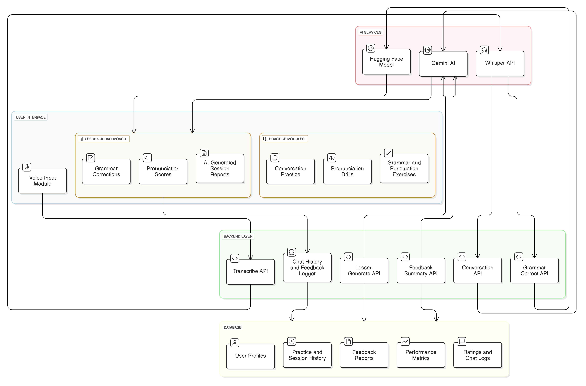

# LinguaLearn Architecture and Data Flow

This document provides a detailed overview of the LinguaLearn application's architecture, component interactions, and data flow between the frontend and backend systems.

## System Architecture Overview

The LinguaLearn application follows a modern client-server architecture with a React-based frontend and a FastAPI Python backend. The system integrates several AI services to provide real-time feedback and analysis for English language learners.

## Key Components

### Frontend Components

1. **User Interface Layer**
   - **PracticePage.jsx**: The central practice interface with multiple tabs:
     - Introduction & Interview Tab
     - Long Turn / Cue Card Tab
     - Discussion Tab
     - Pronunciation Drills Tab
     - Grammar Challenges Tab
   - **VoiceInput.jsx**: Handles audio recording, streaming, and displaying transcription results
   - **Feedback Components**: 
     - GrammarFeedback.jsx
     - PronunciationFeedback.jsx
     - SummarizedFeedback component

2. **State Management**
   - Uses React's useState and useEffect hooks for local state management
   - Manages complex states like:
     - Speech recording state
     - Transcript and highlight data
     - Feedback analysis results
     - Loading states
     - Timer for speaking exercises

3. **API Integration Layer**
   - Handles communication with backend services
   - Manages API request/response cycles
   - Controls error handling and retry logic

### Backend Services

1. **API Gateway (FastAPI)**
   - **Routing Layer**: Manages endpoint definitions and request handling
   - **Authentication**: Handles user sessions and security
   - **Request Validation**: Uses Pydantic for input validation

2. **Core Services**
   - **Speech Processing**:
     - Audio capture and conversion
     - Transcription via Whisper API
     - Pronunciation analysis
   - **Language Analysis**:
     - Grammar correction service
     - Text evaluation
     - Feedback generation
   - **AI Integration**:
     - Google Gemini for content generation
     - Analysis and scoring algorithms
   - **Data Storage**:
     - User profiles and progress tracking
     - Session history
     - Audio storage

## Data Flow

1. **Speech Practice Flow**
   - User selects a practice module in the UI
   - System presents a question or prompt
   - User records their spoken response
   - Audio is sent to the backend for processing
   - Speech is transcribed to text
   - Analysis is performed on the transcription
   - Feedback and corrections are returned to the frontend
   - Results are displayed to the user with visual highlighting

2. **Feedback Generation Flow**
   - Transcribed text is analyzed for:
     - Grammar accuracy
     - Pronunciation quality
     - Vocabulary usage
     - Fluency metrics
   - Multiple AI models evaluate different aspects
   - Scores are calculated and aggregated
   - Detailed feedback is generated with specific improvement suggestions
   - Visual charts and metrics are created for the UI display

3. **Progress Tracking Flow**
   - Session results are stored in the database
   - Historical data is analyzed for improvement trends
   - Achievements are unlocked based on milestones
   - Progress visualizations are generated for the user profile

## Technology Integration Points

The diagram shows key integration points between:
- Frontend React components and backend API endpoints
- Audio processing pipeline and transcription services
- AI analysis services and feedback generation systems
- User data storage and retrieval mechanisms

## Performance Considerations

- Audio processing occurs server-side to reduce client load
- Heavy AI processing tasks are optimized for response time
- UI remains responsive during backend processing
- Error handling ensures graceful degradation

## Security Architecture

- User authentication protects personal data
- API keys for external services are secured server-side
- Audio data is handled according to privacy requirements
- Session management prevents unauthorized access

## Future Extension Points

The architecture is designed to be extensible through:
- Additional practice modules
- New AI analysis capabilities
- Enhanced feedback visualization
- Integration with other learning platforms

---

This architectural overview provides a comprehensive understanding of how the LinguaLearn application functions and how data flows between its various components. The system is designed to deliver a seamless language learning experience while providing valuable, AI-powered feedback to help users improve their English speaking skills.